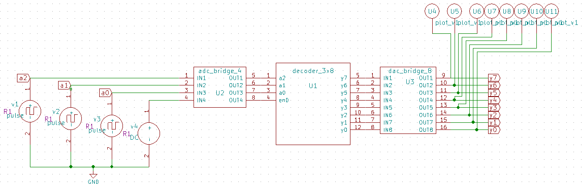
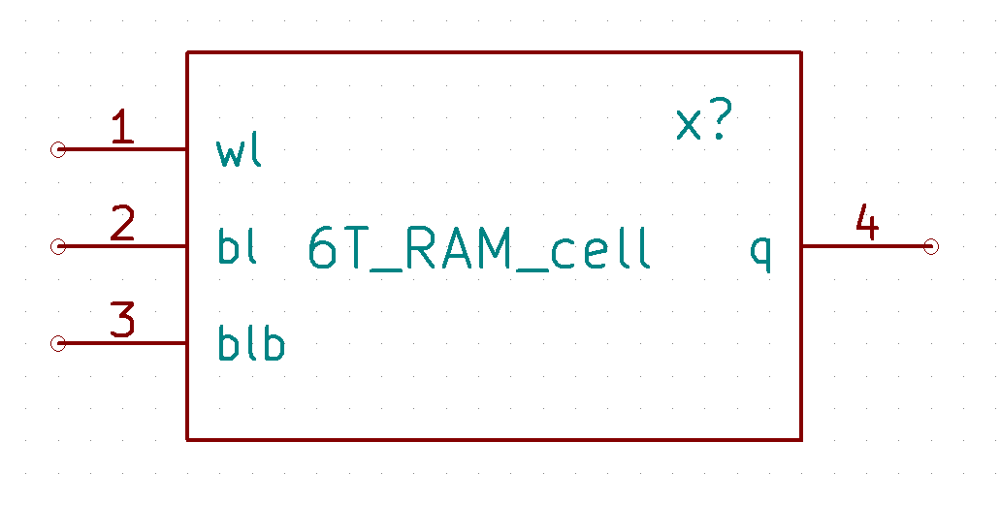
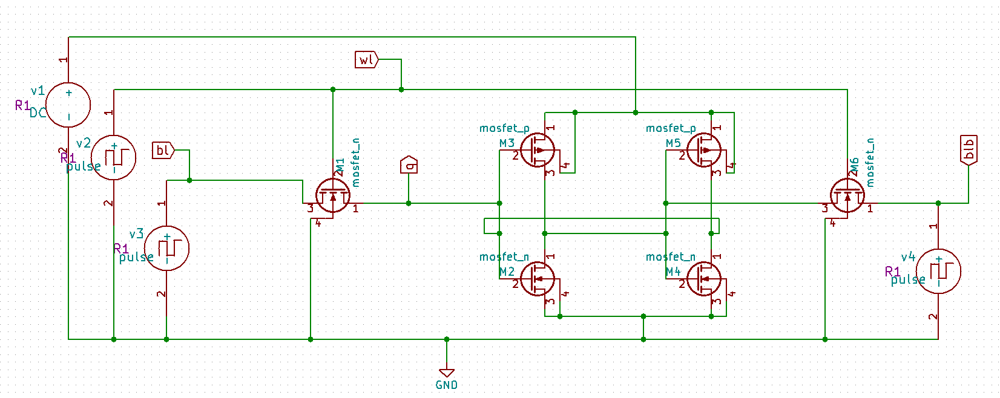
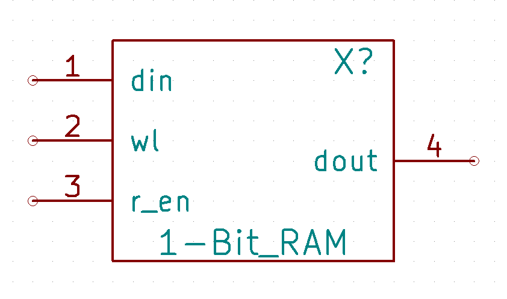
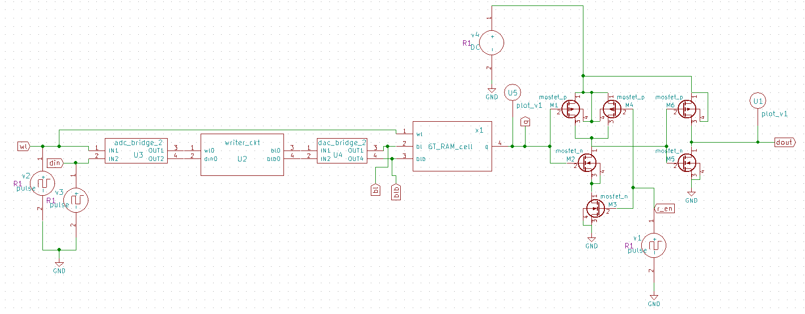
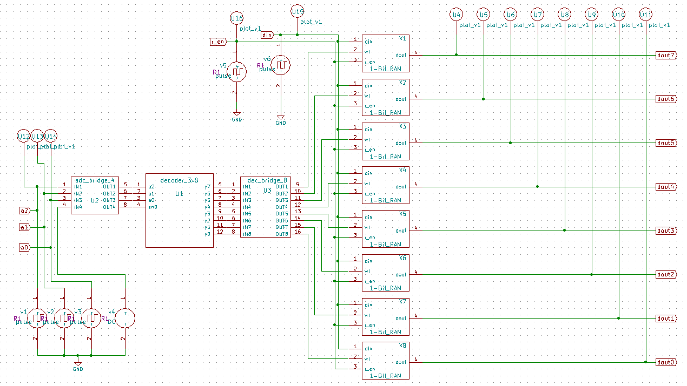
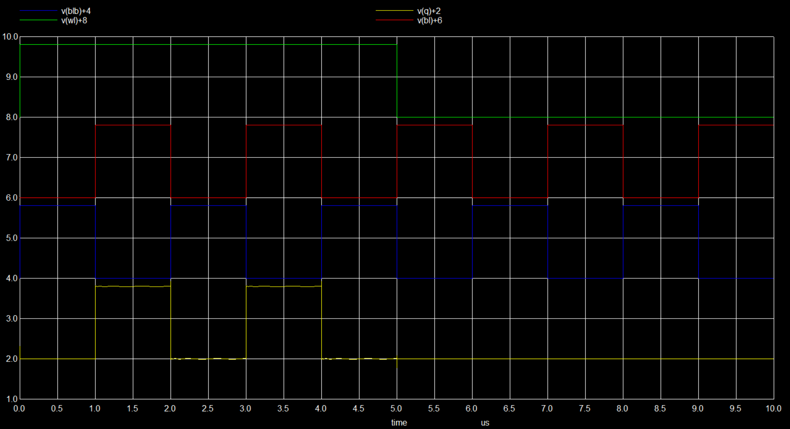
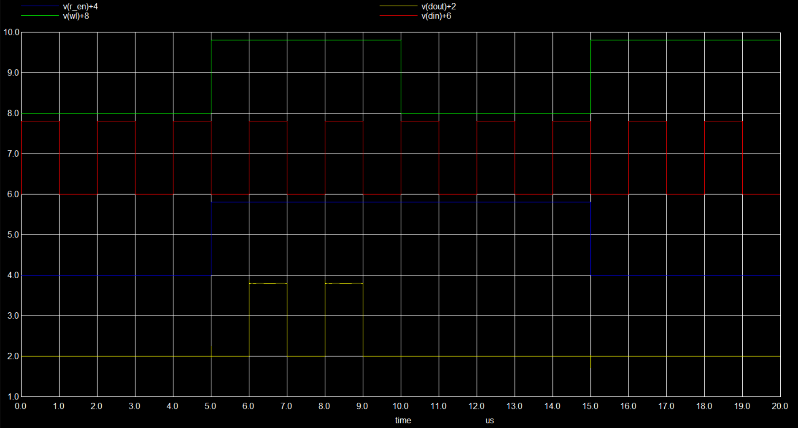
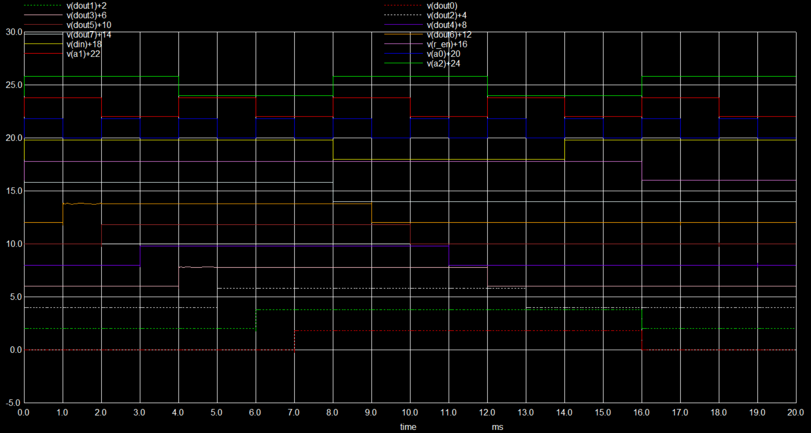

# Mixed Signal Design of 8 Bit SRAM Implemented using eSIM and NgVeri:
This repository presents the mixed signal design of 8-Bit RAM implemented using eSIM and NgVeri.

# Table of Contents:
 * [Introduction](#Introduction)
 * [Building Blocks for 8-Bit SRAM](#Building-Blocks-for-8-Bit-SRAM)
 * [3X8 Decoder](#3X8-Decoder)
 * [6T SRAM Cell](#6T-SRAM-Cell)
 * [Writer Circuit](#Writer-Circuit)
 * [Sensory Circuit](#Sensory-Circuit)
 * [Open Source Tools Used](#Open-Source-Tools-Used)
 * [Pre-Layout Schematics and Simulations](#Pre-Layout-Schematics-and-Simulations)
   * [Schematics](##Schematics)
   * [Simulations](##Simulations)
 * [Netlist of the Circuits](#Netlist-of-the-Circuits)
 * [Author](#Author)
 * [Acknowledgements](#Acknowledgements)
 * [References](#References)

# Introduction:
In modern day computing, the memory elements play a very important role in storing large amounts of data. We all know that SRAM(Static Random Access Memory) is much faster than DRAM (Dynamic RAM), so to utilise SRAM to the fullest we have the concept of caching the memory i.e we save the data in SRAMs on first load so that in the consecutive load time reduces drastically. Here static signifies that the memory will be retained only as long as the RAM is connected to supply. And random access means that we can read/write data from memory irrespective of which sequence the data is present in i.e it will take the same time to access/modify the data irrespective of the bit position. The main advantages of using SRAM is the high switching speed and low power consumption. The applications of this circuit can be a simple memory element, a Lookup table for an FPGA etc. SRAMs are majorly used in server based web applications because the servers are usually switched on all the time. The use of this SRAM is expected to grow further so we are going to design a 8-Bit SRAM based cache memory which is mainly used due to its High performance and Low power in comparison with the DRAM.

# Building Blocks for 8-Bit SRAM:
The components required are a 3X8 Decoder implemented in digital domain using NgVeri, a 1-bit RAM cell which further consists of writer circuit, 6T RAM cell and a sensory circuit all implemented in analog domain using eSIM. The 3X8 Decoder will be used to select the 1-bit RAM cell to which we want to perform the read/write operation to. Basic architecture of a 1-bit SRAM will look like this:

   
  Fig. 1: Basic SRAM Block Diagram:

# 3X8 Decoder:
Decoder is a digital circuit which is used to change a given code into a set of signals. Here we are using a Decoder to select one out of eight 1-bit RAM cells to perform the read/write operation to.

   
  Fig. 2: 3X8 Decoder Block Diagram:

As show above a 3X8 decoder has 4 inputs and 8 outputs. The first three inputs a0,a1,a2 are used to give the coded signal and the fourth signal en acts as an enable. If the en signal is low then all the ouputs y0 to y7 will remain low. The truth table for the 3X8 Decoder is as follows:

   
  Fig. 3: 3X8 Decoder Truth Table:

In this design, the above decoder has been implemented using the MakerChip feature of the eSIM simulator. After opening the eSIM v2.2, open the MakerChip tab present on the left side and load the file with the Verilog code. We can verify the functionality of the loaded verilog code using the MakerChip EDA tool integrated with the eSIM tool. Then we can switch over to the NgVeri tab and use it to convert the verilog code into NgSpice netlist. The verilog code for the above decoder is as follows:

    module decoder_3x8(y,a,en);
    input [2:0]a;
    input en;
    output reg [7:0]y;
    always @(a) 
      begin
        if(en==1)
          begin
            y[0] = !a[0] & !a[1] & !a[2];
            y[1] = a[0] & !a[1] & !a[2];
            y[2] = !a[0] & a[1] & !a[2];
            y[3] = a[0] & a[1] & !a[2];
            y[4] = !a[0] & !a[1] & a[2];
            y[5] = a[0] & !a[1] & a[2];
            y[6] = !a[0] & a[1] & a[2];
            y[7] = a[0] & a[1] & a[2];
          end
        else y = 8'b00000000;
      end
    endmodule

# 6T SRAM Cell:
6T SRAM is a type of transistor based memory element that uses bi-stable latching circuitry to store a single bit. There are 3 inputs to the 6T RAM cell which are Write line(wl), Bit line(bl) and Bit line bar(blb). When the wl is high the N-MOSFETs on either sides of the latched inverters are switched on so that the value in the bl, blb are transferred to opposite sides of the inverter network overriding the already present value. And when the N-MOSFETs are cut-off the value in the inverter network holds till the inverter network has power supply.

   
  Fig. 4: Standard 6T SRAM Cell Circuit:

# Writer Circuit:
This circuit provides the input to the 6T SRAM cell. The funtionality of this block is to provide bl and blb to the SRAM cell, when the inputs wl and din are high the bl and blb will also be high else both the outputs will be low. For this design the Writer Circuit has been designed using the NgVeri feature of the eSIM. The Verilog code is as follows:

    module writer_ckt(bl,blb,wl,din);
      input wl,din;
      output reg bl,blb;
      always @(wl,din) begin
        bl = wl & din;
        blb = !bl;
      end
    endmodule
    
# Sensory Circuit:
This circuit is used to read the data present in the SRAM cell. It has an Read Enable(r_en) pin which when high gives the value present in the SRAM cell as output.

# Open Source Tools Used:
•  eSim: It is an Open Source EDA developed by FOSSEE, IIT Bombay. It is used for electronic circuit simulation. It is made by the combination of two software namely NgSpice and KiCAD. For more details refer:<a href='https://www.esim.fossee.in/'>Here</a> 

• NgSpice: It is an Open Source Software for Spice Simulations. For more details refer:<a href='http://ngspice.sourceforge.net/docs.html'>Here</a> 

• Makerchip: It is an Online Web Browser IDE for Verilog/System-verilog/TL-Verilog Simulation. Refer: <a href='https://www.makerchip.com/'>Here</a> 

• Verilator: It is a tool which converts Verilog code to C++ objects. Refer: <a href='https://www.veripool.org/verilator/'>Here</a> 

# Pre-Layout Schematics and Simulations:

## Schematics:

### 3X8 Decoder:
After the NgSpice netlist has been created as mentioned above, we will be able to find the component listed under "eSim_Ngveri" as the module name we have given. Now to simulate this Digital block in the Analog Environment we will be requiring the ADC and DAC bridges which are provided by the eSim under the "eSim_Hybrid"and can be selected based on the number of inputs and outputs required. Following the above steps will result in the below shown schematic:

   
  Fig. 5: 3X8 Decoder Schematic:

### 6T SRAM Cell:
For this circuit in the schematic we can select the MOSFETS under the "eSim_Devices", connect the circuit as shown in the circuit, annotate the components, perform electrical rules check and generate netlist to complete the schematic. Then using the Sub-circuit feature in the eSIM create the schematic without the sources and replacing the pins with ports, generate the netlist and then go ahead to create a symbol.

   
  Fig. 6: 6T SRAM Symbol:

   
  Fig. 7: 6T SRAM Schematic:

### 1-Bit SRAM Cell:
The writer circuit is created similar to the decoder. After creating the 6T SRAM and writer circuits' schematics & symbols, we interconnect all the components to get the below schematic. Then after verifying the functionality the circuit can be converted to a symbol using the Sub-Circuit features. The Symbol and schematic will look as follows:

   
  Fig. 8: 1-Bit SRAM Symbol:

   
  Fig. 9: 1-Bit SRAM Schematic:

### 8-Bit SRAM Schematic:
After creation of the all the above symbols we interconnect the Decoder and the 1-Bit SRAMs as shown in the schematic to create the 8-Bit SRAM. Based on the input given to the decoder the SRAM cell is selected and the read/write operation is performed.

   
  Fig. 10: 8-Bit SRAM Schematic:

## Simulations:

### 3X8 Decoder:
After making the schematic and generating the netlist go back to eSim; select the KiCAD to NgSpice converter and give the required parameters, convert the present circuit to NgSpice. After following the above steps run the simulation to get the below output:

   
  Fig. 11: Transient Analysis of 3X8 Decoder:

### 6T SRAM Cell:

   
  Fig. 12: Transient Analysis of 6T SRAM Cell:

### 1-Bit SRAM Cell:
After making the schematic and generating the netlist go back to eSim; select the KiCAD to NgSpice converter and give the required parameters(such as analysis type, source details, device information, subcircuit information etc), convert the present circuit to NgSpice. After following the above steps run the simulation to get the below output:

   
  Fig. 12: Transient Analysis of 1-Bit SRAM Cell:

### 8-Bit SRAM:

   
  Fig. 13: Transient Analysis of 8-Bit SRAM:

# Netlist of the Circuits:
• Refer to the netlist of the 3X8 Decoder here: <a href='differential_CSVCO.cir.out'>Netlist</a> 

• Refer to the netlist of the 6T SRAM Cell here: <a href='Differential_csvco_5stage.cir.out'>Netlist</a> 

• Refer to the netlist of the 1-Bit SRAM here: <a href='Differential_csvco_5stage.cir.out'>Netlist</a> 

• Refer to the netlist of the 8-Bit SRAM here: <a href='Differential_csvco_5stage.cir.out'>Netlist</a> 

# Author:
• Trinath Harikrishna, B.Tech(ECE), SRM Institute of Science and Technology, Kattankulattur, Chennai-603203.

# Acknowledgements:
• <a href='https://www.esim.fossee.in/'>FOSSEE Team, IIT Bombay</a> 
• <a href='https://www.vlsisystemdesign.com/'>VLSI System Design (VSD) Corp. Pvt. Ltd India</a> 
• <a href='https://www.makerchip.com/'>MakerChip, RedWood EDA</a> 

# References:
[1] Abhishek Agalet “6T SRAM Cell: Design And Analysis” Int. Journal of Engineering Research and Applications, Vol. 4, Issue 3, March 2014. 
[2] J. Rabaey, A. Chandrakasan, and B. Nicolic, Digital Integrated Circuits A Design Perspective, 2nd ed.Prentice Hall, 2003.
